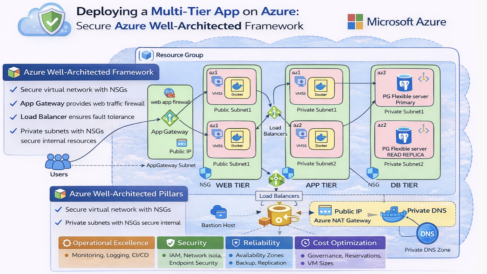

# 🚀 Deploying a Secure, Scalable Multi-Tier Application on Azure using Terraform

This project demonstrates the **design, deployment, and operation of a production-grade multi-tier application on Microsoft Azure**, aligned with the **Azure Well-Architected Framework**.

The focus is not just on *making it work*, but on **making deliberate architectural trade-offs** across security, reliability, cost, and operational excellence — the same principles used in large-scale, real-world systems.

--- 

## 🧩 Project Overview

This project implements a **production-style, three-tier web application on Azure**, designed to demonstrate **real-world cloud architecture, infrastructure decision-making, and operational readiness**.

The system consists of:
- A **public ingress layer** using **Azure Application Gateway** for Layer 7 routing and health checks
- A **stateless application tier** running **containerized Node.js services** on **Azure Virtual Machine Scale Sets**
- A **data access layer** secured via **Managed Identity and Azure Key Vault**, with **no secrets embedded** in code or configuration

All infrastructure is provisioned using **Terraform**, emphasizing **reproducibility, least-privilege security, and operational clarity** over platform complexity.

Rather than optimizing for feature richness, this project intentionally focuses on:
- **Clear architectural boundaries**
- **Explicit trade-offs and non-goals**
- **Failure-mode awareness**
- **Leadership-level system design thinking**

> **In short:** this is not a demo app — it’s a **production-aligned cloud system** built to reflect how **senior engineers, engineering managers, and technical leaders** design, reason about, and operate infrastructure at scale.
---
## 🏗️ ☁️ Azure Well-Architected Framework Alignment and Architecture Overview

This architecture aligns with Microsoft’s **Azure Well-Architected Framework**, emphasizing intentional design decisions over default configurations.

| Pillar | How It’s Addressed |
|------|------------------|
| **Operational Excellence** | Infrastructure defined using Terraform for reproducible, auditable deployments. Clear health endpoints, structured logging, and explicit dependency management across Application Gateway, VMSS, and database layers. |
| **Security** | Defense-in-depth approach using Application Gateway with WAF, private subnets, strict NSGs, Azure Bastion for secure access, and Azure Key Vault for secret management. No direct public access to application or database tiers. |
| **Reliability** | Virtual Machine Scale Sets provide self-healing and horizontal scaling. Azure Load Balancers and Application Gateway health probes ensure traffic is routed only to healthy backend instances. PostgreSQL Flexible Server includes read replica support. |
| **Performance Efficiency** | Tiered architecture reduces contention and improves latency. Internal load balancing enables efficient east-west traffic. Stateless application containers allow rapid scaling based on demand. |
| **Cost Optimization** | Right-sized VM SKUs, autoscaling to match traffic patterns, managed database services to reduce operational overhead, and centralized NAT Gateway to control outbound traffic costs. |
---

### 🔐 Security
- Azure Application Gateway with Web Application Firewall (WAF) protects against OWASP Top 10 threats.
- Strict Network Security Groups (NSGs) enforce least-privilege network access across tiers.
- Web, application, and database tiers are isolated using private subnets to minimize blast radius.
- Azure Bastion enables secure administrative access without exposing VMs to the public internet.
- Azure Key Vault securely stores secrets such as database credentials and sensitive configuration.

---

### 🛡 Reliability
- Virtual Machine Scale Sets (VMSS) provide high availability, self-healing, and horizontal scaling.
- Azure Load Balancers distribute traffic across healthy instances, removing single points of failure.
- PostgreSQL Flexible Server includes a read replica to support high availability and read scalability.
- Health probes ensure traffic is routed only to healthy backend instances.

---

### ⚡ Performance Efficiency
- Horizontal autoscaling enables the platform to handle variable traffic without manual intervention.
- Tier separation reduces resource contention and improves request latency.
- Internal load balancing enables low-latency communication between application components.

---

### 💰 Cost Optimization
- Autoscaling ensures infrastructure scales with demand, avoiding over-provisioning.
- VM sizes are deliberately right-sized to balance performance and cost.
- Managed database services reduce operational overhead and long-term maintenance costs.
- Centralized NAT Gateway controls outbound traffic, avoiding unnecessary public IP sprawl.

---

### 🔧 Operational Excellence
- Infrastructure is fully provisioned using **Terraform**, enabling repeatable and auditable deployments.
- Infrastructure-as-Code (IaC) improves change management, consistency, and rollback capability.
- Centralized logging and metrics support faster incident detection and resolution.
- Explicit health endpoints enable proactive monitoring and automated recovery.

---
### Monthly Cost Breakdown
| Component | Cost | Optimization |
|-----------|------|--------------|
| VMSS (2 instances) | $60 | Auto-scales to 1 off-peak |
| App Gateway | $35 | Shared across services |
| PostgreSQL | $45 | Could use B-tier for even less |
| Data Transfer | $5 | Minimal, internal routing |
| **Total** | **$145/month** | **40-60% during off-peak** |

---
### 🛠️ Components

1. **Frontend Tier:**
   - Node.js application running in Docker containers
   - VM Scale Set with auto-scaling
   - Application Gateway with WAF for security
   - Deployed in public subnets across 2 availability zones

2. **Backend Tier:**
   - Go application running in Docker containers
   - VM Scale Set with auto-scaling
   - Internal Load Balancer
   - Deployed in private subnets across 2 availability zones

3. **Database Tier:**
   - Azure Database for PostgreSQL Flexible Server
   - Primary server with read-write capability
   - Read replica for read-only operations
   - Deployed in database subnets across 2 availability zones

4. **Supporting Infrastructure:**
   - Docker Hub for container images
   - Azure Key Vault for secrets management (including Docker Hub credentials)
   - Azure Bastion for secure SSH access
   - Private DNS Zones for name resolution
   - Network Security Groups for each subnets
---

## 📚 Lessons Learned

- **Infrastructure problems are rarely “just networking”** — most issues surfaced at the intersection of identity, routing, health probes, and service configuration.
- **Managed services simplify operations but require deep understanding** of networking and DNS behavior, especially in private endpoint scenarios.
- **Health checks are first-class citizens** — misaligned probe paths or ports can break an otherwise healthy system.
- **Terraform enforces discipline** — but also exposes implicit dependencies that must be explicitly modeled.
- **Observability accelerates learning** — logs, metrics, and health endpoints significantly reduced debugging time.

---

## ⚠️ Challenges Faced

- Debugging **Application Gateway backend health** when VMSS instances were healthy but not correctly registered.
- Aligning **Docker container ports**, load balancer probes, and Application Gateway listener configurations.
- Handling **private DNS resolution** for PostgreSQL Flexible Server within isolated VNets.
- Managing **ACR image availability** and ensuring VMSS instances pulled the correct container versions.
- Identifying silent failures caused by mismatched health endpoints (`/health` vs `/`).

Each challenge required systematic troubleshooting across multiple Azure services — reinforcing the importance of **systems thinking over isolated fixes**.

---

## ⚖️ Architectural Trade-offs & Non-Goals

| Area | Decision | Rationale |
|----|--------|-----------|
| **Container Orchestration** | Did not use AKS | VM Scale Sets were intentionally chosen to reduce platform complexity and operational overhead, keeping focus on core architecture principles rather than cluster management. This mirrors early-stage or cost-conscious production environments. |
| **High Availability Scope** | Regional HA instead of multi-region | Architecture prioritizes availability zones within a single region to balance resilience, latency, and cost. Multi-region failover was considered but deemed unnecessary for the current reliability objectives. |
| **CI/CD Complexity** | No full GitOps pipeline | Deployment automation was kept intentionally minimal to emphasize infrastructure correctness, repeatability, and observability before introducing advanced delivery workflows. |
| **Service Mesh** | No service mesh introduced | Traffic patterns are simple and well-understood. Introducing a service mesh would add operational complexity without proportional reliability or security benefits at this scale. |
| **Zero Trust Maturity** | Partial Zero Trust implementation | Network isolation, identity-based access, and secret management are implemented. Advanced conditional access, workload identity federation, and continuous posture assessment are future enhancements. |
| **Autoscaling Strategy** | Reactive scaling over predictive scaling | Autoscaling is driven by platform signals (VMSS health and load) rather than predictive or ML-based models, favoring reliability and explainability over optimization. |
| **Observability Depth** | Metrics-focused over full tracing | Core metrics and health checks are implemented first. Distributed tracing and deep request-level correlation were deferred to avoid premature complexity. |
| **Cost vs. Resilience** | Balanced, not maximized | The design intentionally avoids over-engineering (e.g., always-on replicas, cross-region traffic routing) to maintain a strong cost-to-value ratio. |
| **Security Hardening** | No customer-managed HSM | Azure-managed Key Vault encryption was selected for operational simplicity. Customer-managed keys and HSM-backed keys remain a future hardening option. |

| Dimension              | Reflection                                                      |
| ---------------------- | --------------------------------------------------------------- |
| Engineering Philosophy | Prefer explicit trade-offs over maximal feature sets            |
| Leadership Lens        | Architecture should reduce team cognitive load, not increase it |
| System Design          | Simplicity enables faster diagnosis, iteration, and scaling     |
| Growth Path            | This system is intentionally extensible without being overbuilt |

---

## 🎯 Why This Project Matters

This project reflects how I approach engineering problems:

- ✅ Think in **systems**, not just services  
- ✅ Design for **failure, scale, and security from day one**  
- ✅ Balance **technical depth with business impact**  
- ✅ Treat infrastructure as a **product**, not a one-time setup  

It mirrors the kind of decision-making, ownership, and technical leadership expected in **senior engineering, engineering management, and platform roles**.

---

## 🚀 Core Skills Used

- **Cloud**: Azure (VMSS, App Gateway, PostgreSQL, Key Vault)
- **IaC**: Terraform (modular, tested)
- **Languages**: Go, Python, Bash
- **Containers**: Docker, image optimization
- **Observability**: Metrics, logging, alerting concepts
- **Security**: Defense-in-depth, compliance frameworks

--- 
## 📜 Architectural Decision Records (ADRs)

| ADR ID      | Decision                                 | Context                                                                                       | Rationale (Why)                                                                                 | Trade-offs / Consequences                                                             |
| ----------- | ---------------------------------------- | --------------------------------------------------------------------------------------------- | ----------------------------------------------------------------------------------------------- | ------------------------------------------------------------------------------------- |
| **ADR-001** | VM Scale Sets instead of AKS             | Needed horizontal scalability and health-based recovery without excessive platform complexity | VMSS keeps operational focus on core infrastructure fundamentals and reduces cognitive overhead | Manual container lifecycle management, less orchestration flexibility than Kubernetes |
| **ADR-002** | Azure Application Gateway as L7 ingress  | Required TLS termination, health probes, and intelligent routing                              | Native Azure integration, production-grade Layer 7 routing, simpler than third-party ingress    | Higher cost than L4 LB, sensitive to probe/backend misconfiguration                   |
| **ADR-003** | Managed Identity + Azure Key Vault       | Secure handling of DB credentials and secrets                                                 | Eliminates hardcoded secrets, enforces least privilege, aligns with Zero Trust                  | Initial IAM setup complexity, steeper troubleshooting curve                           |
| **ADR-004** | Single-region, zone-resilient deployment | High availability required without global scale                                               | Realistic cost/resilience balance, mirrors many production systems                              | No cross-region DR, regional outage remains a risk                                    |
| **ADR-005** | Metrics-first observability              | Needed visibility with minimal tooling overhead                                               | Faster signal-to-noise ratio, easier operational ownership                                      | Limited request tracing, debugging deep flows is harder                               |

--- 

## 📌 Next Improvements

- Introduce Azure Monitor dashboards and alerts
- Add CI/CD for container builds and Terraform plans
- Enable blue/green or canary deployments
- Expand database backup and disaster recovery strategy

---
## 🏁 Final Reflection

| Dimension              | Reflection                                                      |
| ---------------------- | --------------------------------------------------------------- |
| Engineering Philosophy | Prefer explicit trade-offs over maximal feature sets            |
| Leadership Lens        | Architecture should reduce team cognitive load, not increase it |
| System Design          | Simplicity enables faster diagnosis, iteration, and scaling     |
| Growth Path            | This system is intentionally extensible without being overbuilt |

Key takeaway:
> *This project reflects how I design systems in real organizations — start simple, document decisions, acknowledge trade-offs, and evolve architecture with intent rather than novelty.*

---